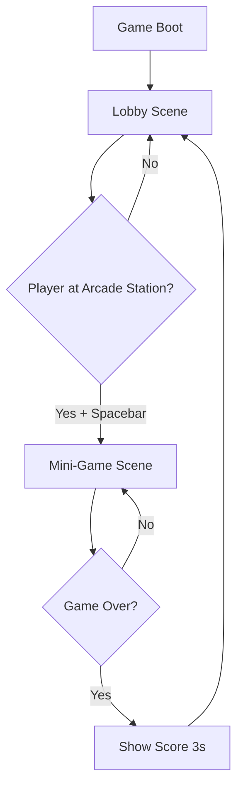

# Design Document: Hackathon Arcade Lobby

## Overview

The Hackathon Arcade Lobby is a dual-scene Phaser 3 game that combines a free-roaming lobby environment with an embedded Space Invaders-style mini-game. The game celebrates hackathon and startup culture through thematic decorations and gameplay mechanics. The entire implementation must fit within 50KB after minification, using only procedurally generated graphics and Web Audio API for sound.

### Key Design Principles

1. **Minimalism**: Every byte counts - use short variable names, minimal abstractions, and efficient algorithms
2. **Procedural Generation**: All graphics generated using Phaser's Graphics API to avoid image file overhead
3. **Modular Scenes**: Clean separation between Lobby and Mini-Game scenes for maintainability
4. **Responsive Controls**: Dual-player support with distinct control schemes (Arrow keys vs WASD)
5. **Progressive Enhancement**: Core gameplay first, polish second

## Architecture

### Scene Structure



### Game Configuration

```javascript
const config = {
  type: Phaser.AUTO,
  width: 800,
  height: 600,
  physics: {
    default: 'arcade',
    arcade: {
      gravity: { y: 0 },
      debug: false
    }
  },
  scene: [LobbyScene, MiniGameScene]
};
```

**Rationale**: 
- Arcade physics provides lightweight collision detection
- Zero gravity for top-down lobby movement
- 800x600 matches standard arcade resolution and requirement specs

## Components and Interfaces

### 1. Lobby Scene

#### Responsibilities
- Render hackathon office environment
- Handle player movement within boundaries
- Detect arcade station interaction
- Transition to mini-game

#### Key Objects

**Environment Graphics**
- **Office Floor**: 800x600 rectangle with grid pattern
- **Banana Decorations**: 5-8 yellow ellipses with brown stems scattered around
- **Money Decorations**: Green rectangles with "$" text symbols
- **Arcade Station**: Colorful rectangle (100x120) with screen representation
- **Boundaries**: Invisible physics bodies at edges

**Player Avatars**
```javascript
// Player 1 - Blue circle
{
  x: 100,
  y: 300,
  radius: 20,
  color: 0x0066ff,
  controls: cursors (arrow keys)
}

// Player 2 - Red circle  
{
  x: 700,
  y: 300,
  radius: 20,
  color: 0xff0066,
  controls: WASD keys
}
```

#### Movement System

```javascript
// Velocity-based movement
const SPEED = 200; // pixels per second

update() {
  // Player 1
  if (cursors.left.isDown) player1.setVelocityX(-SPEED);
  else if (cursors.right.isDown) player1.setVelocityX(SPEED);
  else player1.setVelocityX(0);
  
  if (cursors.up.isDown) player1.setVelocityY(-SPEED);
  else if (cursors.down.isDown) player1.setVelocityY(SPEED);
  else player1.setVelocityY(0);
  
  // Similar for Player 2 with WASD
}
```

**Rationale**: Velocity-based movement provides smooth, physics-integrated motion with automatic boundary collision.

#### Interaction System

```javascript
// Overlap detection
this.physics.add.overlap(
  [player1, player2],
  arcadeStation,
  this.showInteractPrompt,
  null,
  this
);

// Transition trigger
if (spaceKey.isDown && playerNearStation) {
  this.scene.start('MiniGame', { players: activePlayers });
}
```

### 2. Mini-Game Scene (Pitch Invaders)

#### Responsibilities
- Spawn and animate investor waves
- Handle player shooting mechanics
- Detect collisions between pitches and investors
- Track and display score
- Determine game over conditions

#### Key Objects

**Player Ships**
```javascript
{
  x: 100 or 700,
  y: 550,
  width: 40,
  height: 20,
  color: 0x0066ff or 0xff0066,
  speed: 250
}
```

**Pitch Projectiles**
```javascript
{
  width: 4,
  height: 15,
  color: 0xffff00,
  speed: -400, // upward
  damage: 1
}
```

**Investor Entities**
```javascript
{
  width: 30,
  height: 30,
  color: 0x00ff00,
  points: 10,
  formation: grid (8 columns × 4 rows),
  moveSpeed: 50,
  moveDirection: 1 or -1,
  descendAmount: 20
}
```

#### Wave Movement System

```javascript
// Classic Space Invaders movement pattern
update() {
  investors.children.iterate((inv) => {
    inv.x += moveSpeed * moveDirection;
  });
  
  // Check boundaries
  const rightmost = Math.max(...investors.children.entries.map(i => i.x));
  const leftmost = Math.min(...investors.children.entries.map(i => i.x));
  
  if (rightmost > 770 || leftmost < 30) {
    moveDirection *= -1;
    investors.children.iterate((inv) => {
      inv.y += descendAmount;
    });
  }
}
```

**Rationale**: Mimics classic Space Invaders behavior - horizontal movement with descent at boundaries creates escalating tension.

#### Shooting System

```javascript
// Fire rate limiting
const FIRE_COOLDOWN = 300; // ms
let lastFired = 0;

if (spaceKey.isDown && time.now > lastFired + FIRE_COOLDOWN) {
  const pitch = pitches.create(player.x, player.y - 20, null);
  pitch.setVelocityY(-400);
  lastFired = time.now;
  playShootSound();
}
```

#### Collision System

```javascript
this.physics.add.overlap(
  pitches,
  investors,
  (pitch, investor) => {
    pitch.destroy();
    investor.destroy();
    score += 10;
    scoreText.setText('Score: ' + score);
    playHitSound();
    
    // Check win condition
    if (investors.countActive() === 0) {
      this.gameOver(true);
    }
  },
  null,
  this
);
```

#### Game Over Conditions

```javascript
// Loss condition: investor reaches bottom
if (investor.y > 530) {
  this.gameOver(false);
}

// Win condition: all investors destroyed
if (investors.countActive() === 0) {
  this.gameOver(true);
}

gameOver(won) {
  // Freeze game
  this.physics.pause();
  
  // Display final score
  const msg = won ? 'FUNDED!' : 'REJECTED!';
  this.add.text(400, 300, msg + '\nScore: ' + score, {
    fontSize: '48px',
    color: won ? '#00ff00' : '#ff0000',
    align: 'center'
  }).setOrigin(0.5);
  
  // Return to lobby after 3 seconds
  this.time.delayedCall(3000, () => {
    this.scene.start('Lobby');
  });
}
```

## Data Models

### Game State

```javascript
// Global state (minimal - passed between scenes)
{
  activePlayers: 1 or 2,
  highScore: number
}
```

### Player State (per scene)

```javascript
// Lobby
{
  sprite: Phaser.Physics.Arcade.Sprite,
  controls: Phaser.Input.Keyboard.CursorKeys,
  nearStation: boolean
}

// Mini-Game
{
  ship: Phaser.Physics.Arcade.Sprite,
  controls: Phaser.Input.Keyboard.CursorKeys,
  lastFired: number
}
```

### Mini-Game State

```javascript
{
  score: number,
  investors: Phaser.Physics.Arcade.Group,
  pitches: Phaser.Physics.Arcade.Group,
  moveDirection: 1 or -1,
  moveSpeed: number,
  gameActive: boolean
}
```

## Procedural Graphics Generation

### Lobby Graphics

```javascript
// Office floor with grid
const floor = this.add.graphics();
floor.fillStyle(0x333333, 1);
floor.fillRect(0, 0, 800, 600);
floor.lineStyle(1, 0x444444, 0.5);
for (let i = 0; i < 800; i += 50) {
  floor.lineBetween(i, 0, i, 600);
}
for (let j = 0; j < 600; j += 50) {
  floor.lineBetween(0, j, 800, j);
}

// Banana decoration
const banana = this.add.graphics();
banana.fillStyle(0xffff00, 1);
banana.fillEllipse(0, 0, 20, 40);
banana.fillStyle(0x8b4513, 1);
banana.fillRect(-2, -22, 4, 8);

// Money decoration
const money = this.add.graphics();
money.fillStyle(0x00ff00, 1);
money.fillRect(0, 0, 30, 15);
money.lineStyle(2, 0x006600, 1);
money.strokeRect(0, 0, 30, 15);
this.add.text(x + 8, y + 2, '$', { fontSize: '12px', color: '#006600' });

// Arcade station
const station = this.add.graphics();
station.fillStyle(0x8b00ff, 1);
station.fillRect(0, 0, 100, 120);
station.fillStyle(0x000000, 1);
station.fillRect(10, 10, 80, 60); // screen
station.fillStyle(0x00ffff, 1);
station.fillCircle(50, 90, 15); // button
```

### Mini-Game Graphics

```javascript
// Player ship (triangle)
const ship = this.add.graphics();
ship.fillStyle(color, 1);
ship.fillTriangle(20, 0, 0, 20, 40, 20);

// Investor (rectangle with face)
const investor = this.add.graphics();
investor.fillStyle(0x00ff00, 1);
investor.fillRect(0, 0, 30, 30);
investor.fillStyle(0x000000, 1);
investor.fillCircle(10, 10, 3); // eye
investor.fillCircle(20, 10, 3); // eye
investor.fillRect(8, 20, 14, 2); // mouth

// Pitch projectile (small rectangle)
const pitch = this.add.graphics();
pitch.fillStyle(0xffff00, 1);
pitch.fillRect(0, 0, 4, 15);
```

**Rationale**: Simple geometric shapes minimize code size while maintaining visual clarity. Each graphic is under 10 lines of code.

## Audio System

### Web Audio API Implementation

```javascript
// Audio context (shared)
const audioCtx = new (window.AudioContext || window.webkitAudioContext)();

// Shoot sound (short beep)
function playShootSound() {
  const osc = audioCtx.createOscillator();
  const gain = audioCtx.createGain();
  
  osc.connect(gain);
  gain.connect(audioCtx.destination);
  
  osc.frequency.value = 440; // A4
  gain.gain.setValueAtTime(0.3, audioCtx.currentTime);
  gain.gain.exponentialRampToValueAtTime(0.01, audioCtx.currentTime + 0.1);
  
  osc.start(audioCtx.currentTime);
  osc.stop(audioCtx.currentTime + 0.1);
}

// Hit sound (higher pitch)
function playHitSound() {
  const osc = audioCtx.createOscillator();
  const gain = audioCtx.createGain();
  
  osc.connect(gain);
  gain.connect(audioCtx.destination);
  
  osc.frequency.value = 880; // A5
  gain.gain.setValueAtTime(0.2, audioCtx.currentTime);
  gain.gain.exponentialRampToValueAtTime(0.01, audioCtx.currentTime + 0.15);
  
  osc.start(audioCtx.currentTime);
  osc.stop(audioCtx.currentTime + 0.15);
}

// Game over sound (descending tone)
function playGameOverSound() {
  const osc = audioCtx.createOscillator();
  const gain = audioCtx.createGain();
  
  osc.connect(gain);
  gain.connect(audioCtx.destination);
  
  osc.frequency.setValueAtTime(440, audioCtx.currentTime);
  osc.frequency.exponentialRampToValueAtTime(220, audioCtx.currentTime + 0.5);
  gain.gain.setValueAtTime(0.3, audioCtx.currentTime);
  gain.gain.exponentialRampToValueAtTime(0.01, audioCtx.currentTime + 0.5);
  
  osc.start(audioCtx.currentTime);
  osc.stop(audioCtx.currentTime + 0.5);
}
```

**Rationale**: Web Audio API generates tones programmatically with zero file size overhead. Simple oscillators create retro arcade sound effects.

## Error Handling

### Physics Edge Cases

```javascript
// Prevent players from getting stuck
if (player.body.embedded) {
  player.body.touching.none = false;
}

// Ensure projectiles are cleaned up
pitches.children.iterate((pitch) => {
  if (pitch.y < -20) pitch.destroy();
});
```

### Scene Transition Safety

```javascript
// Prevent double-transitions
if (this.scene.isActive('MiniGame')) return;

// Clean up before transition
this.physics.world.removeAllListeners();
this.input.keyboard.removeAllListeners();
```

### Boundary Enforcement

```javascript
// Hard clamp for safety (backup to physics)
player.x = Phaser.Math.Clamp(player.x, 20, 780);
player.y = Phaser.Math.Clamp(player.y, 20, 580);
```

## Testing Strategy

### Unit Testing Approach

Given the 50KB constraint and single-file structure, testing will focus on:

1. **Manual Playtesting**: Primary validation method
2. **Size Verification**: Automated check via `pnpm check-restrictions`
3. **Browser Console**: Monitor for runtime errors

### Test Scenarios

**Lobby Scene**
- [ ] Single player movement in all directions
- [ ] Two-player simultaneous movement without interference
- [ ] Boundary collision prevents escape
- [ ] Arcade station interaction prompt appears
- [ ] Spacebar triggers mini-game transition
- [ ] Scene transition preserves player count

**Mini-Game Scene**
- [ ] Player ships appear at correct positions
- [ ] Left/right movement works for both players
- [ ] Shooting creates projectiles with cooldown
- [ ] Projectiles move upward and destroy on contact
- [ ] Investors move in formation (left-right-descend pattern)
- [ ] Collision detection works (pitch + investor)
- [ ] Score increments correctly
- [ ] Game over triggers on investor reaching bottom
- [ ] Game over triggers on all investors destroyed
- [ ] Final score displays for 3 seconds
- [ ] Return to lobby works correctly

**Audio**
- [ ] Shoot sound plays on fire
- [ ] Hit sound plays on collision
- [ ] Game over sound plays on end
- [ ] No audio errors in console

**Performance**
- [ ] Game runs at 60 FPS
- [ ] No memory leaks during scene transitions
- [ ] File size ≤ 50KB after minification

### Size Optimization Checklist

- [ ] Variable names shortened (e.g., `p1` instead of `player1`)
- [ ] Repeated values extracted to constants
- [ ] Unnecessary comments removed
- [ ] Graphics code minimized
- [ ] No unused functions
- [ ] Run `pnpm check-restrictions` before each commit

## Performance Considerations

### Optimization Techniques

1. **Object Pooling**: Reuse projectile objects instead of creating/destroying
```javascript
const pitches = this.physics.add.group({
  defaultKey: null,
  maxSize: 20,
  runChildUpdate: true
});
```

2. **Efficient Collision**: Use groups instead of individual sprite checks
```javascript
this.physics.add.overlap(pitches, investors, handler);
// vs checking each pitch against each investor manually
```

3. **Minimal Text Updates**: Only update score text on change
```javascript
if (newScore !== score) {
  score = newScore;
  scoreText.setText('Score: ' + score);
}
```

4. **Graphics Caching**: Create graphics once, reuse instances
```javascript
// Create template
const shipGraphic = this.make.graphics({}, false);
// Generate texture
shipGraphic.generateTexture('ship', 40, 20);
// Use texture for all ships
const ship = this.physics.add.sprite(x, y, 'ship');
```

### Target Performance Metrics

- **Frame Rate**: 60 FPS constant
- **Load Time**: < 2 seconds
- **Memory**: < 50MB
- **File Size**: ≤ 50KB minified

## Size Budget Allocation

Estimated breakdown of 50KB budget:

- **Lobby Scene**: ~15KB
  - Movement logic: 3KB
  - Graphics generation: 5KB
  - Interaction system: 3KB
  - Scene setup: 4KB

- **Mini-Game Scene**: ~25KB
  - Investor wave system: 8KB
  - Shooting mechanics: 5KB
  - Collision detection: 4KB
  - Graphics generation: 5KB
  - Game over logic: 3KB

- **Audio System**: ~5KB
  - Web Audio functions: 5KB

- **Configuration & Utilities**: ~5KB
  - Game config: 2KB
  - Shared utilities: 3KB

**Buffer**: ~0KB (tight fit - requires optimization)

## Future Enhancements (Post-Competition)

If size constraints are relaxed:

1. **Power-ups**: Special pitches with area effects
2. **Multiple Waves**: Increasing difficulty levels
3. **Leaderboard**: Persistent high score storage
4. **More Mini-Games**: Additional arcade stations with different games
5. **Enhanced Graphics**: More detailed procedural art
6. **Music**: Background music tracks
7. **Particle Effects**: Explosions and visual feedback
8. **Mobile Support**: Touch controls for mobile devices

## Technical Constraints Summary

✅ **Allowed**:
- Phaser 3 (loaded externally, not counted)
- Procedural graphics via Graphics API
- Web Audio API for sound
- Base64 data URIs (if needed)
- Arcade physics

❌ **Forbidden**:
- External images/sprites
- External audio files
- Network calls (fetch, XHR)
- Import/require statements
- External URLs (except data: URIs)

## Conclusion

This design provides a complete, implementable blueprint for the Hackathon Arcade Lobby game. The architecture balances feature richness with size constraints through procedural generation, efficient physics, and minimal abstractions. The dual-scene structure allows for clean separation of concerns while maintaining a cohesive player experience. All requirements are addressed with concrete implementation strategies that fit within the 50KB budget.
