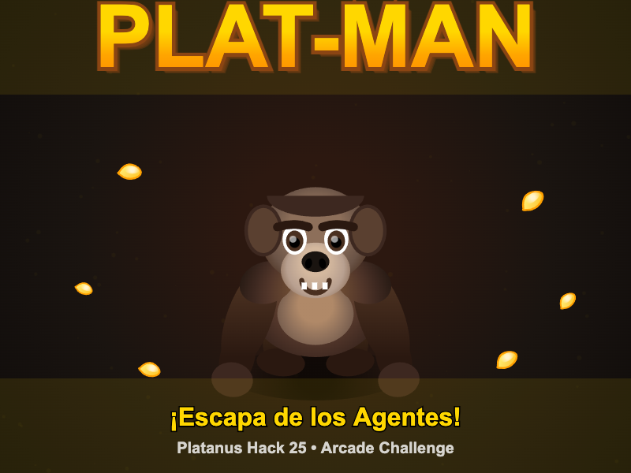

# 🎮 Bubble Pop 🫧

Un juego arcade para Platanus Hack 25 donde los jugadores disparan burbujas para conectar 3+ del mismo color y hacerlas explotar. ¡Elimina todas las burbujas para ganar!



🎯 Descripción
Modo de 1 o 2 jugadores simultáneos
Sistema de capas que caen cada 60 segundos
Gravedad automática después de 1 minuto
Sistema de ranking con Top 10 (almacenado en localStorage)
Música y sonidos generados con Web Audio API
Sprites procedurales dibujados en runtime (sin imágenes externas)

🎯 Controles
Jugador 1: A|D (mover cañón) • Q|W|E|S (apuntar) • ESPACIO (disparar)
Jugador 2: J|L (mover cañón) • U|I|O|K (apuntar) • ENTER (disparar)
📁 Estructura del Proyecto
platanus-hack-25-arcade/
├── game.js          # ✅ Código principal del juego (sin imports)
├── metadata.json    # ✅ Nombre y descripción del juego
├── index.html       # HTML con Phaser desde CDN
├── README.md        # Este archivo
└── bublepop.png     # Imagen de portada 800x600px
⚙️ Características Técnicas
Cumple con restricciones:
✅ Sin imports: JavaScript vanilla puro
✅ Sin URLs externas en game.js (Phaser desde CDN no cuenta)
✅ Sin fetch/XMLHttpRequest
✅ Sprites procedurales: Dibujados con Canvas API
✅ Audio generado: Usando Web Audio API de Phaser
✅ Tamaño optimizado: Código minificable
Phaser 3 Features utilizados:
Phaser.Game y configuración
Physics (Arcade)
Sprites y texturas procedurales
Tweens para animaciones
Keyboard input
Groups y colisiones
LocalStorage para persistencia
🚀 Desarrollo
Instalar dependencias:
pnpm install
Ejecutar en desarrollo:
pnpm dev
Verificar restricciones:
pnpm check-restrictions
🎨 Sprites
Todos los sprites son generados proceduralmente en el código:

Burbujas: 12 colores con gradientes y brillos
Cañones: Triángulos con efectos de glow
Indicadores: Trayectorias punteadas con animaciones
🎵 Audio
Sonidos generados con osciladores:
Disparo: Tono ascendente (800Hz → 400Hz)
Explosión: Tono descendente (600Hz → 200Hz)
Alerta: Sirena alternante (800Hz ↔ 600Hz)

🏆 Sistema de Ranking
Top 10 mejores puntuaciones
Guardado en localStorage
📊 Mecánicas de Juego
Capas que caen: Cada 60 segundos se agrega una nueva capa
Gravedad automática: Después de 1 minuto las burbujas caen gradualmente
Modo simultáneo: Ambos jugadores juegan al mismo tiempo
🎯 Objetivo del Juego
Conecta 3 o más burbujas del mismo color disparando burbujas. Las burbujas flotantes también caen. ¡Elimina todas las burbujas para ganar!

📝 Puntuación
10 puntos por grupo de burbujas explotadas
5 puntos por burbujas flotantes eliminadas
1 punto por segundo sobrevivido
🔧 Próximos Pasos
 Ejecutar pnpm check-restrictions para verificar tamaño
 Optimizar código si excede 50KB
👥 Créditos
Juego creado para Platanus Hack 25: Arcade Challenge
Creado por: Exequiel Alvarado

---

## 🏆 Prizes

### 🥇 First Place:
- 💵 **$250 USD in cash**
- 🎟️ **A slot to participate in Platanus Hack**
- 🎮 **Your game featured on the arcade machine**

### 🥈 Second Place:
- 💵 **$100 USD in cash**
- 🎮 **Your game featured on the arcade machine**

---

## 📋 Restrictions

Your game must comply with these technical restrictions:

### Size Limit
- ✅ **Maximum 50KB after minification** (before gzip)
- The game code is automatically minified - focus on writing good code

### Code Restrictions
- ✅ **Pure vanilla JavaScript only** - No `import` or `require` statements
- ✅ **No external URLs** - No `http://`, `https://`, or `//` (except `data:` URIs for base64)
- ✅ **No network calls** - No `fetch`, `XMLHttpRequest`, or similar APIs
- ✅ **Sandboxed environment** - Game runs in an iframe with no internet access

### What You CAN Use
- ✅ **Phaser 3** (v3.87.0) - Loaded externally via CDN (not counted in size limit)
- ✅ **Base64-encoded images** - Using `data:` URIs
- ✅ **Procedurally generated graphics** - Using Phaser's Graphics API
- ✅ **Generated audio tones** - Using Phaser's Web Audio API
- ✅ **Canvas-based rendering and effects**

🕹️ Controls
Your game will run on a real arcade cabinet with physical joysticks and buttons!

**Arcade Button Layout**

**Arcade Button Mapping**
The arcade cabinet sends specific key codes when buttons are pressed:

**Player 1:**
- Joystick: P1U, P1D, P1L, P1R (Up, Down, Left, Right)
- Joystick Diagonals: P1DL, P1DR (Down-Left, Down-Right)
- Action Buttons: P1A, P1B, P1C (top row) / P1X, P1Y, P1Z (bottom row)
- Start: START1

**Player 2:**
- Joystick: P2U, P2D, P2L, P2R
- Joystick Diagonals: P2DL, P2DR
- Action Buttons: P2A, P2B, P2C / P2X, P2Y, P2Z
- Start: START2

**Testing Locally**
For local testing, you can map these arcade buttons to keyboard keys. The mapping supports multiple keyboard keys per arcade button (useful for alternatives like WASD + Arrow Keys). See game.js for the complete ARCADE_CONTROLS mapping template.

By default:
- Player 1 uses WASD (joystick) and U/I/O/J/K/L (action buttons)
- Player 2 uses Arrow Keys (joystick) and R/T/Y/F/G/H (action buttons)

💡 **Tip:** Keep controls simple - design for joystick + 1-2 action buttons for the best arcade experience!

---

## ⏰ Deadline & Submission

**Deadline:** Friday, November 14, 2025 at 23:59 (Santiago time)

### How to Submit

Submitting your project is easy:

1. **Save your changes** - Make sure `game.js` and `metadata.json` are ready
2. **Git push** - Push your code to your repository:
   ```bash
   git add .
   git commit -m "Final submission"
   git push
   ```
3. **Hit Submit** - Click the submit button in the development UI and follow the steps

That's it! 🎉

---

## 🚀 Quick Start

### 1. Install Dependencies
```bash
pnpm install
```

### 2. Start Development Server
```bash
pnpm dev
```
This starts a server at `http://localhost:3000` with live restriction checking.

### 3. Build Your Game
- **Edit `game.js`** - Write your arcade game code
- **Update `metadata.json`** - Set your game name and description
- **Watch the dev server** - It shows live updates on file size and restrictions

---

## 🤖 Vibecoding Your Game

This challenge is designed for **vibecoding** - building your game with AI assistance!

### What We've Set Up For You

- **`AGENTS.md`** - Pre-configured instructions so your IDE (Cursor, Windsurf, etc.) understands the challenge
- **`docs/phaser-quick-start.md`** - Quick reference guide for Phaser 3
- **`docs/phaser-api.md`** - Comprehensive Phaser 3 API documentation

Your AI agent already knows:
- ✅ All the challenge restrictions
- ✅ How to use Phaser 3 effectively
- ✅ Best practices for staying under 50KB
- ✅ What files to edit (`game.js` and `metadata.json` only)

### How to Vibecode

Simply tell your AI assistant what game you want to build! For example:

> "Create a Space Invaders clone with colorful enemies"
> 
> "Build a flappy bird style game with procedural graphics"
> 
> "Make a breakout game with power-ups"

Your AI will handle the implementation, keeping everything within the restrictions automatically!
